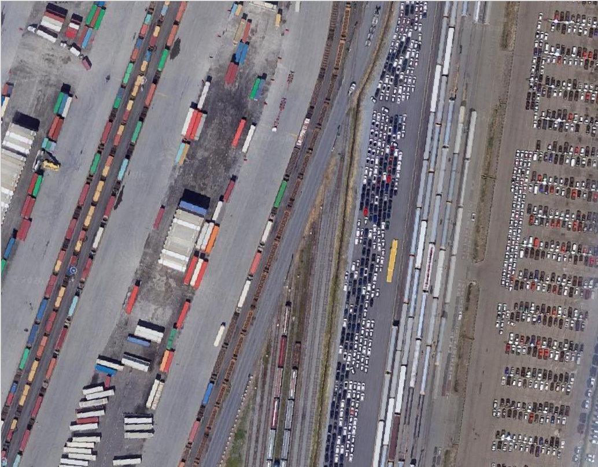
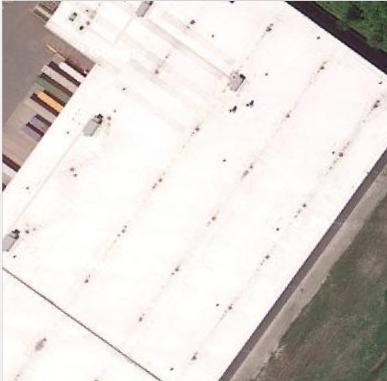
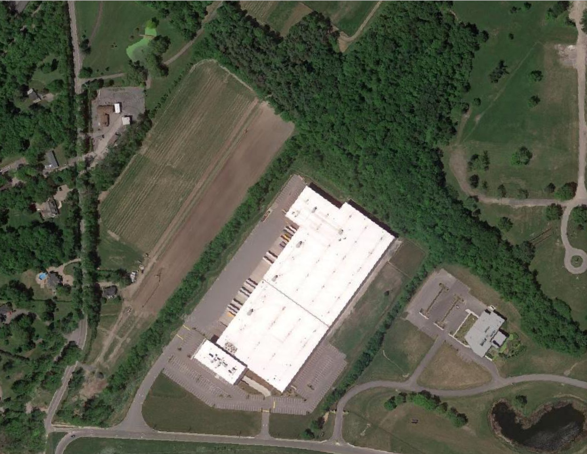
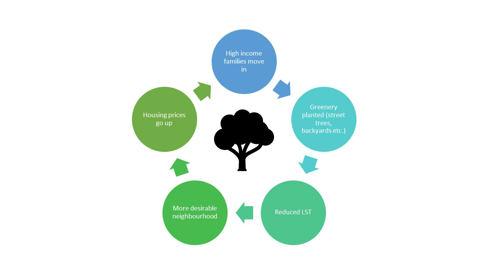
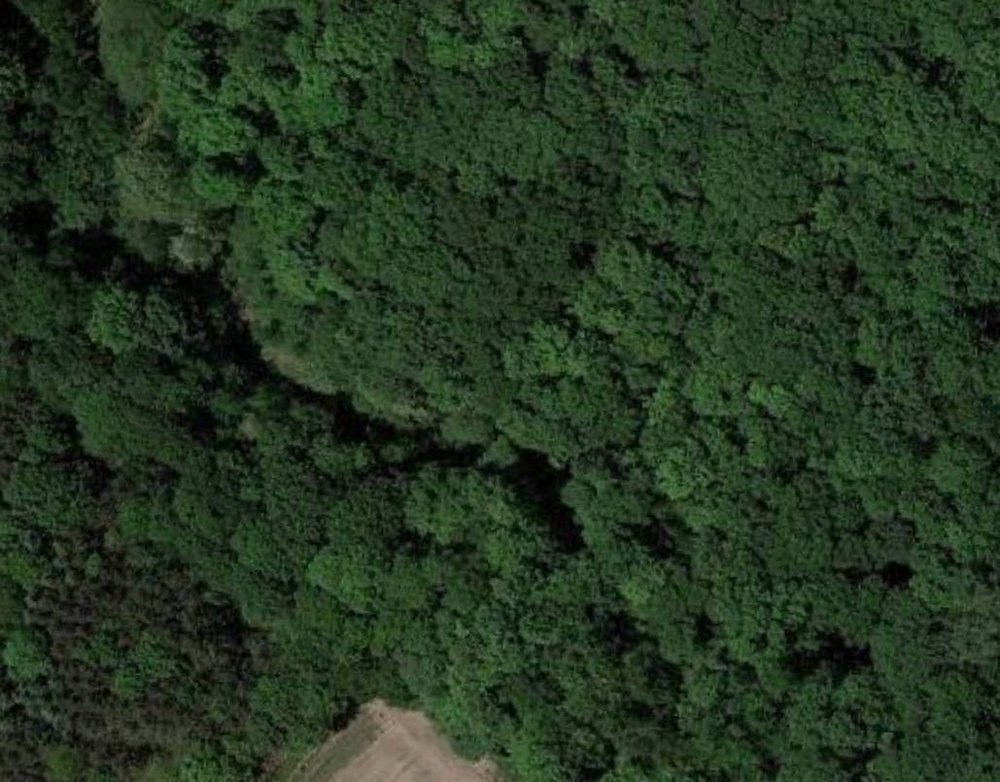
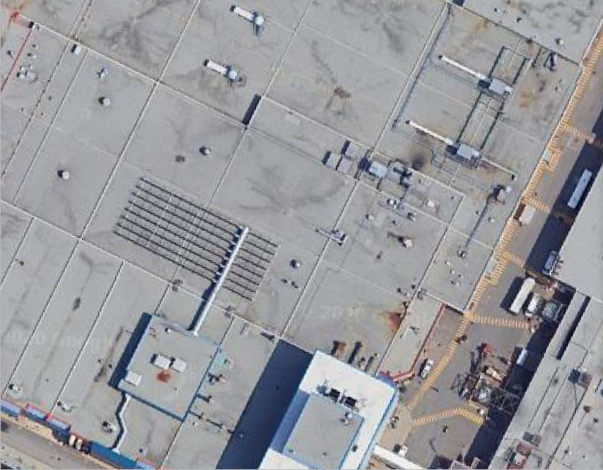
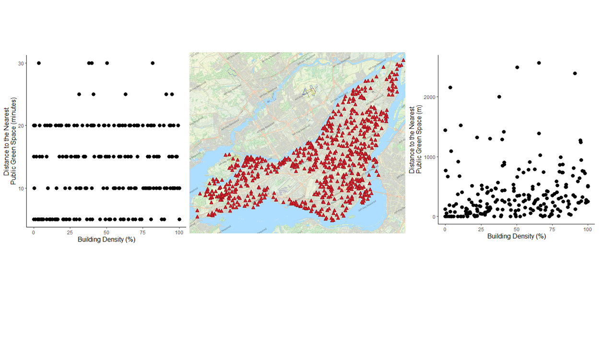

```{r setup, include=FALSE}
knitr::opts_chunk$set(echo = TRUE)
```

## Plot 1


```{r graph 1, echo=FALSE}
data<-read.csv("Data/shortlist_data_0813.csv")
library(ggplot2)
library(stringr)
library(tidyverse)
library(viridis)

my.theme<-theme(axis.title = element_text(size=12),
                legend.title=element_text(size=12),
                legend.text = element_text(size=10))
plot1<-ggplot(data, aes(x=BD, y=LST_mean, color=Imp.)) +
  geom_point(size=3)+
  labs(x="Building Density (%)", y="Land Surface Temperature (C)",color="Impervious \nCover (%)")+
  geom_smooth(method=lm, color="black")+
  theme_classic()+
  scale_color_viridis(option="D")

plot1+my.theme
```
Building density is an important predictor of LST and so is impervious cover. However, these two variables are not to be confused. Yellow points represent over 90% impervious cover. Note how these can be observed even at sites of 0% building density. Below is an example of an area with 0 buildings but nearly 100% impervious cover.


A couple sites had very high building density and impervious cover, yet still maintained relatively low LST. This is because these sites were surrounded by leafy green areas.

This is site 245 (a site with very high building density but low LST). When we zoom out on this image, it is easier to understand why this occurs.



## Plot 2

```{r plot 2, echo=FALSE}
plot2<-ggplot(data, aes(x=BD, y=LST_mean, color=Income)) +
  geom_point(size=3)+
  labs(x="Building Density (%)", y="Land Surface Temperature (C)",color="Median \nHousehold \nIncome")+
  geom_smooth(method=lm, color="black")+
  theme_classic()+
  scale_color_viridis(option="A")+
  geom_vline(xintercept=c(50), linetype="dotted")
plot2+my.theme
```
Households earning more than $100,000/year were not found in areas above 50% building density.

## Plot 3
```{r graph 3, echo=FALSE}
plot3<-ggplot(data, aes(x=petrochem_distance, y=NO2_mean, color=Income)) +
  geom_point(size=3)+
  labs(x="Distance to Petrochemical Facility", y="NO2 Concentration (mg/m3)",color="Median \nHousehold \nIncome")+
  geom_smooth(method=lm, color="black")+
  theme_classic()+
  scale_color_viridis(option="B")+
  geom_vline(xintercept=c(10000, 30000), linetype="dotted")
plot3+my.theme
```
The biggest indicator of how much NO2 you will be exposed to in Montreal is distance to the petrochemical facility 'Industry B'. No household earning in excess of 50,000/year lives within 10km of the petrochemical facility. Households earning over 100,000/year are not found within 30km of Industry B.

## Plot 4

```{r plot 6, echo=FALSE}
plot6<-ggplot(data, aes(x=Income, y=LST_mean, color=NDVImean)) +
  geom_point(size=3)+
  labs(x="Income", y="Land Surface Temperature (C)",color="NDVI")+
  theme_classic()+
  scale_color_viridis(option="C")+
  geom_smooth(method=lm, color="black")+
  geom_hline(yintercept=c(35), linetype="dotted")
plot6+my.theme
```
There is a negative relationship between median household income and LST. Much of the spread of the points here can be explained by differences in NDVI. Note how the extreme low temperature points all have very high NDVI while the extreme high points all have very low NDVI. The mid-NDVI sites are clustered near the mid-range of LST.



## Plot 5

```{r plot 5, echo=FALSE}
mid<-50
plot5<-ggplot(data, aes(x=BD, y=LST_mean, color=X.canopy)) +
  geom_point(size=3)+
  labs(x="Building Density (%)", y="Land Surface Temperature (C)",color="Canopy \nCover (%)")+
  geom_smooth(method=lm, color="black")+
  theme_classic()+
  scale_color_gradientn(colours=rainbow(5))
plot5+my.theme
```

Differences in canopy cover help explain some of the spread of these points. Notice how the extreme low temperature value is also the only point with >90% canopy cover. Also notice how the 0% canopy cover sites are more concentrated towards the higher end of temperature, while the opposite is true for sites with >20% canopy cover.


Site 86 (lowest LST value)

Site 186 (highest LST value)

## Plot 6

The distance to the nearest publicly accessible greenspace was measured using multiple metrics that all reached the same conclusion: that greenspaces are evenly distributed among the building densities. Pictured here are the data presented in 3 ways.

The far left image measures green space distance as a categorical variable. If the nearest green space was within 5 minutes walking distance aloing the road network, it is marked as 5, if it was within 10 minutes walking distance it was marked as 10, so on and so forth up to a 30 minute walking distance along the road network. The center image is a map depicting the locations of all publicly accessible greenspaces that are larger than 0.5 ha. The far right image measures green space distance as a continuous variable (the euclidean distance in meters from the study site centroid to the entrance of the nearest public green space). You can see in all three figures that the green spaces are uniformly distributed.
